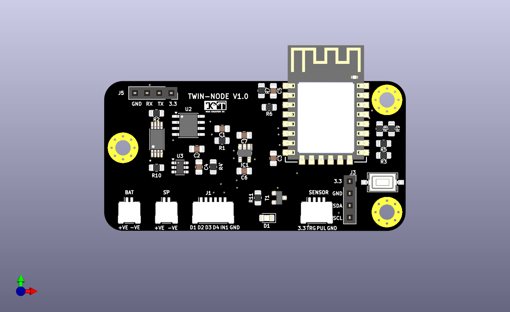

# TWIN NODE V1.0

### Low-Power Outdoor Water Level Sensor Node

---

## 📌 Overview

**TWIN NODE V1.0** is the **first hardware version** of a low-power, ESP-NOW-based water level monitoring system.
It is **designed for learning and prototyping**, with all components sourced from [ROBU.IN](https://robu.in).

---

## ⚙️ Features

* **ESP-12F (ESP8266)** controller
* **Waterproof ultrasonic sensor** for water level measurement
* **Female headers** for programming and I2C expanders
* **SCL & SDA I2C lines** accessible for future expansion
* **Three mounting holes** for secure installation
* PCB size: **~65 × 35 mm**
* Component placement: Functional but **aesthetic may be rough (good for first-time design)**
* **DRC & ERC verified**, footprints selected for manufacturability

---

## 🔧 Notes

* Ready for **battery + solar operation**
* Ideal for testing ESP-NOW wireless communication
* Serves as **foundation for TWIN NODE V2.0**

---

### 👤 Author

**MAATHES-THILAK-K (KMT)**
Embedded Systems | PCB Design | Robotics

---
