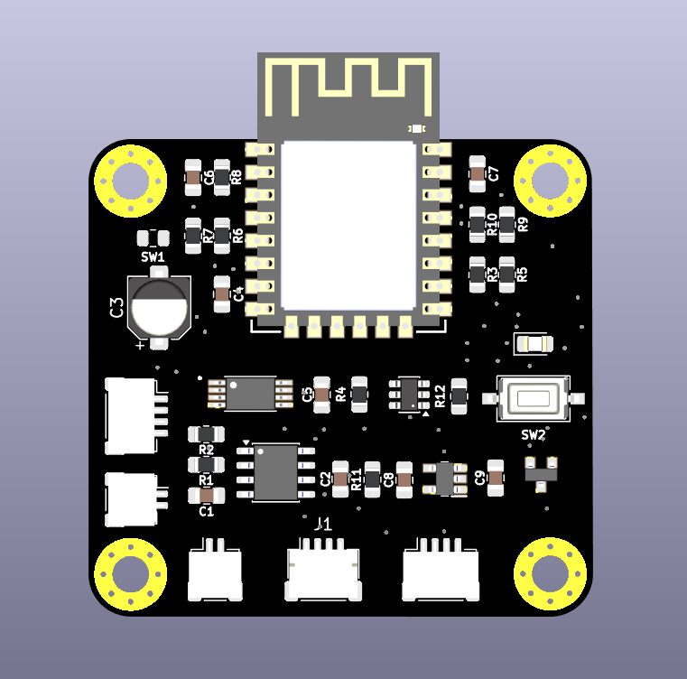

# TWIN NODE V2.0

### Low-Power Outdoor Water Level Sensor Node – Improved Design

---

## 📌 Overview

**TWIN NODE V2.0** is the **fabricated and tested hardware revision** of the low-power ESP-NOW water level monitoring system.
This version incorporates **real-world fabrication feedback**, improving reliability and simplifying the design for future revisions.

All components are sourced from [ROBU.IN](https://robu.in).

---

## ⚙️ Key Updates from V1.0

* **Mounting holes:** Increased from 3 to **4** for better casing support
* **I2C expanders:** Removed, no longer required
* **Programming & power connections:** Female headers replaced with **JST connectors**
* **Component placement:** Fully optimized for **aesthetic and practical routing**
* **PCB traces:** Increased width to support **longer interconnections**
* **PCB size:** ~45 × 45 mm
* **DRC & ERC:** Fully verified
* **Fabricated & powered ON successfully**

---

## 🛠️ Fabrication Feedback & Design Correction (Important)

During physical testing of the fabricated PCB, the following observation was made:

### ❌ Unnecessary Pull-Up Resistors Identified

* **GPIO0 (BOOT)** – 10 kΩ resistor **not required**
* **RST (RESET)** – 10 kΩ resistor **not required**

These resistors were found to be **redundant** and **can be safely removed** in future PCB revisions.

### ✅ Reason

* ESP8266 internal pull-ups are sufficient for:

  * Normal boot operation
  * Reliable reset behavior
* External 10 kΩ resistors on **GPIO0** and **RST**:

  * Do **not improve stability**
  * Increase component count unnecessarily
  * Slightly complicate routing and assembly

➡️ **Action for next revision:**
Remove the 10 kΩ pull-up resistors on **GPIO0 (BOOT)** and **RST**.

---

## 🔧 Design Notes

* Designed for **battery + solar operation**
* Optimized for **low power outdoor deployment**
* ESP-NOW based communication (no Wi-Fi AP dependency)
* Layout finalized with **manufacturability in mind**
* Suitable for **field deployment and enclosure mounting**

---

## 📦 Project Status

✔ PCB fabricated
✔ Power-up verified
✔ Boot & reset behavior validated
✔ Design improvement identified for next revision

---

### 👤 Author

**MAATHES-THILAK-K (KMT)**
Embedded Systems | PCB Design | Robotics
